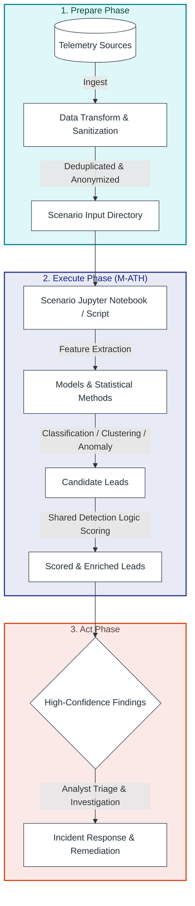
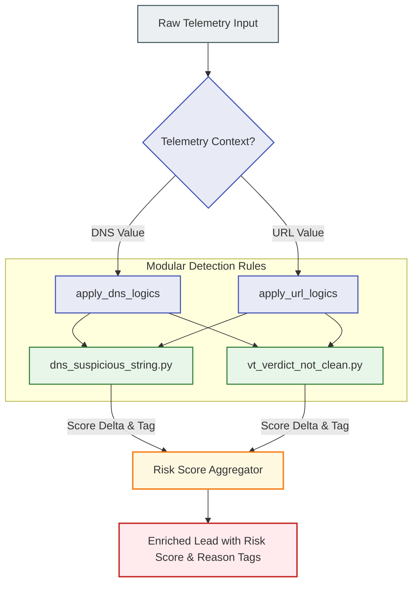
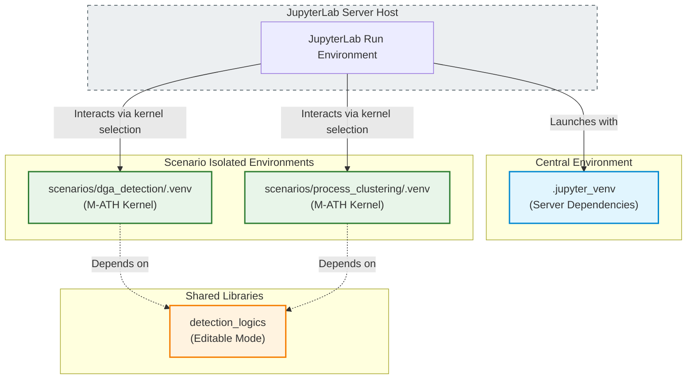

# Threat Hunting M-ATH Catalog

<p align="left">
  <a href="https://www.splunk.com/en_us/blog/security/peak-threat-hunting-framework.html"></a>
  <a href="https://www.virustotal.com/"></a>
  <a href="https://github.com/features/actions"></a>
  <a href="https://github.com/PowerShell/PowerShell"></a>
  <a href="https://www.python.org/"></a>
  <a href="https://jupyter.org/"></a>
</p>

**Model-Assisted Threat Hunting (M-ATH)** — algorithmically-driven Cyber Threat Hunting topics, aligned with the [Splunk PEAK Threat Hunting Framework](https://www.splunk.com/en_us/blog/security/peak-threat-hunting-framework.html).

This repository manages threat hunting scenarios that use machine learning and statistical methods — such as classification, clustering, anomaly detection, and time-series analysis — to surface leads that simpler methods may miss.

## M-ATH & PEAK Framework

M-ATH is one of three hunt types in the PEAK Framework (*Prepare, Execute, and Act with Knowledge*). It uses algorithms to find leads for threat hunting, enabling more advanced and experimental hunts when:

- **Simpler methods aren't accurate enough** — e.g., dictionary-based DGA domains that blend in with legitimate traffic
- **Classes of behavior (benign/malicious) can be labeled** — enabling supervised classification
- **Data is high-volume or hard to summarize** — suited to dimensionality reduction and clustering
- **Identification is confident but classification is difficult** — analyst-in-the-loop for final decisions

> [!NOTE]
> Scenarios described in `scenarios/catalog.csv` must use one of the PEAK M-ATH sub-processes listed below (described in `PEAK/Splunk PEAK Threat Hunters Cookbook.pdf`):
> - **Forecasting and Anomaly Detection** (p. 11)
> - **Clustering** (p. 14)
> - **Model-Assisted Methods** (p. 30 and 40)

> [!TIP]
> **📖 Reference Materials & Guides**
> - [Introducing the PEAK Threat Hunting Framework](https://www.splunk.com/en_us/blog/security/peak-threat-hunting-framework.html)
> - [Model-Assisted Threat Hunting (M-ATH) with the PEAK Framework](https://www.splunk.com/en_us/blog/security/peak-framework-math-model-assisted-threat-hunting.html)
> - [The Threat Hunter's Cookbook - A practitioner’s guide to threat hunting by SURGe’s security experts](https://www.splunk.com/en_us/campaigns/threat-hunters-cookbook.html) 



## Scenarios (M-ATH Topics)

Scenarios are organized in `scenarios/` with a catalog in `scenarios/catalog.csv`. Examples include:

| Category | Examples |
|----------|----------|
| **Classification** | Dictionary DGA detection, malicious Base64 payloads, LOLBins (LLM) |
| **Clustering** | Process parent-child chains, similarity analysis, user-agent injection |
| **Anomaly detection** | DNS/URL anomaly analysis, network beaconing (jittered), rare process behavior |
| **Time-series** | C2 beaconing, compromised accounts, data exfiltration |

See `scenarios/catalog.csv` for the full list of use cases, models, and data sources.

## Detection Logics (Shared scoring & enrichment rules)

`detection_logics/` contains **modular “detection logic” rules** used by scenarios to:
- **Increase a risk score** when a hit occurs
- **Add standardized reason tags** (string identifiers) explaining *why* something was scored

These rules are intended to be reusable across multiple hunts, so scenario notebooks/scripts can focus on analytics (feature extraction, clustering, anomaly detection, ranking) while delegating common “rule hits” to this shared package.

### How detection logics are applied

Detection logics are executed via the helper functions exposed by the package:

- `detection_logics.apply_dns_logics(value: str, decoded_value: str) -> (score_delta: int, reasons: list[str])`
- `detection_logics.apply_url_logics(value: str, decoded_value: str) -> (score_delta: int, reasons: list[str])`

Each logic implements a simple contract:

- `apply(value: str, decoded_value: str) -> (score_delta: int, reason_name: str | None)`
- Return `(0, None)` if there is no hit.
- Return a positive score delta and a stable reason name if the rule hits.

**Inputs**
- `value`: the original/raw DNS or URL value
- `decoded_value`: a decoded/normalized version when applicable (for example values prefixed with `punycode:` or `base64:`)

**Outputs**
- `score_delta`: how much to increase the candidate’s score
- `reasons`: a list of reason names corresponding to rules that hit (for auditability and analyst triage)



### Current detection logic modules

At commit `62e72c5b475a51addb1a843a6a0bbb0df7da86e9`, the `detection_logics/` package includes:

- `detection_logics/dns_suspicious_string.py`
  - Detects known suspicious strings in raw DNS values (punycode labels) and/or decoded values.
  - Scoring: `+1` per unique suspicious string found
  - Reason: `dns_suspicious_string`

- `detection_logics/vt_verdict_not_clean.py`
  - Detects and weights non-clean VirusTotal verdict tokens embedded in text (e.g. `vt:malicious`, `vt_verdict=suspicious`, `[vt: suspicious]`).
  - Scoring:
    - `malicious` → `+2`
    - `suspicious` (and other non-clean verdicts) → `+1`
  - Reason: `vt_verdict_not_clean`

- `detection_logics/__init__.py`
  - Registers which logic functions run for DNS vs URL contexts and exposes:
    - `apply_dns_logics()`
    - `apply_url_logics()`

> If you add a new detection logic module, ensure it exports an `apply()` function with the same signature and (if applicable) register it in `detection_logics/__init__.py` so it is included in the DNS/URL logic pipelines.

## Data Transformation Utilities

The [data_transform](./data_transform) directory provides command-line tools for sanitizing and preprocessing telemetry:

* **Data Anonymisation Tool** ([data_anonymisation.py](./data_transform/data_anonymisation.py)):
  - Searches and replaces sensitive information like usernames, domain logins, computer names, and company names.
  - Features smart auto-discovery of user profile paths (`C:\Users\...`, `/home/...`) and common hostnames (e.g., `DESKTOP-XXXXXXX`).
  - Customizable using mappings in `data_anonymisation.input`.
  - Supports `--dry-run`, `--in-place` modification, and custom output suffixes.
* **Data Deduplication Tool** ([data_deduplication.py](./data_transform/data_deduplication.py)):
  - Performs case-insensitive deduplication and filters out empty lines.
  - **Numeric Aggregation Support**: Automatically identifies CSV columns containing "occurrence" or "prevalence" (case-insensitive) and sums their numeric values across duplicate rows, merging them into a single row.
  - Supports `--stats`, `--dry-run`, `--in-place` modification, and custom output suffixes.

See [data_transform/README.md](./data_transform/README.md) for usage flags and examples.

## Project Structure

```
├── .github/                       # GitHub Actions & validation helper scripts
│   ├── scripts/
│   │   ├── create_data_transform_issues.py
│   │   ├── create_missing_catalog_issues.py
│   │   ├── create_missing_scenarios_folder_issues.py
│   │   ├── find_missing_in_catalog.py
│   │   └── find_missing_scenarios_folders.py
│   └── workflows/
│       ├── check-catalog-sync.yml
│       ├── check-data-transform.yml
│       ├── check-scenarios-folders.yml
│       ├── download-confusables.yml
│       └── virustotal-high-confidence.yml
├── data_grabber/
│   └── sentinelone-powerquery/
│       ├── sentinelone_query.py   # SentinelOne PowerQuery collector
│       └── config.json            # Local query configuration
├── data_transform/                # Telemetry cleaning and deduplication utilities
│   ├── data_anonymisation.py
│   ├── data_anonymisation.input.example
│   └── data_deduplication.py
├── detection_logics/              # Shared scoring and enrichment helpers (reusable rule hits)
├── install/
│   ├── bootstrap_jupyter_venv.ps1 # Central JupyterLab environment bootstrap (Windows)
│   ├── bootstrap_jupyter_venv.py  # Central JupyterLab environment bootstrap (Python)
│   ├── bootstrap_scenario_venv.ps1 # Scenario-specific venv bootstrap & kernel registration (Windows)
│   ├── bootstrap_scenario_venv.sh # Scenario-specific venv bootstrap & kernel registration (Bash)
│   ├── install_dependencies.ps1   # Local dependency bootstrap
│   ├── install_dependencies.sh    # Linux/macOS dependency bootstrap
│   └── requirements.txt           # Shared Python dependencies
├── PEAK/                          # Reference material for the PEAK framework
├── scenarios/
│   ├── catalog.csv                # M-ATH use case catalog
│   ├── */README.md                # Scenario documentation
│   ├── */input/                   # Source telemetry or exported datasets
│   ├── */output/                  # Analysis outputs and ranked findings
│   └── */*.ipynb                  # Scenario notebooks where implemented
├── scripts/
│   ├── add_virustotal_verdicts.py
│   ├── bootstrap_scenarios.py
│   ├── fetch_sentinelone.py
│   ├── json_to_csv.py
│   ├── run_analysis.py
│   └── update_catalog_folders.py
└── scripts/                       # Utility and runner scripts
    ├── start_jupyterlab.ps1       # Runner to start central JupyterLab (Windows)
    └── start_jupyterlab.py        # Runner to start central JupyterLab (Python)
```

## Architecture

| Component | Purpose |
|-----------|---------|
| **GitHub Actions** | Quality assurance: checks catalog sync, checks scenario folder integrity, tests data transform compliance, updates Unicode confusables, and enrichments |
| **Local execution** | Fully supported using central JupyterLab runner (`.jupyter_venv`) and scenario-isolated environments (`.venv`) registered as custom Jupyter kernels |

## Setup & Local Development

### JupyterLab Development Flow (Recommended)



Local notebooks are executed in scenario-isolated virtual environments to prevent dependency conflicts, and registered as custom kernels for JupyterLab:

1. **Bootstrap Central JupyterLab**:
   Install the central JupyterLab server environment under `.jupyter_venv`:
   * **Windows (PowerShell):**
     ```powershell
     .\install\bootstrap_jupyter_venv.ps1
     ```
   * **Linux/macOS:**
     ```bash
     python install/bootstrap_jupyter_venv.py
     ```

2. **Bootstrap Scenario Virtual Environment**:
   Create the scenario's isolated `.venv`, install the shared `detection_logics` package in editable mode (`pip install -e`), and register its custom Jupyter kernel (e.g., `M-ATH: dga_detection`):
   * **Windows (PowerShell):**
     ```powershell
     .\install\bootstrap_scenario_venv.ps1 -ScenarioPath scenarios\dga_detection
     ```
   * **Linux/macOS:**
     ```bash
     chmod +x ./install/bootstrap_scenario_venv.sh
     ./install/bootstrap_scenario_venv.sh scenarios/dga_detection
     ```

3. **Start JupyterLab**:
   Launch JupyterLab in headless mode:
   * **Windows (PowerShell):**
     ```powershell
     .\scripts\start_jupyterlab.ps1
     ```
   * **Linux/macOS:**
     ```bash
     python scripts/start_jupyterlab.py
     ```
   Copy the server URL and token from the console output, open it in your browser, load the scenario notebook (`.ipynb`), and select the registered `M-ATH: <scenario_name>` kernel from the top-right kernel dropdown.

---

### Scripts Execution (Alternative Local Setup)

To execute standalone helper Python scripts outside of JupyterLab:

* **Windows (PowerShell):**
  ```powershell
  .\install\install_dependencies.ps1
  ```
* **Linux/macOS:**
  ```bash
  chmod +x ./install/install_dependencies.sh
  ./install/install_dependencies.sh
  ```
For VirusTotal-enabled scripts, set `VT_API_KEY` in your environment.

---

### GitHub Actions Integration

1. **VirusTotal Enrichment**:
   - Add the `VT_API_KEY` secret in repository settings (**Settings** → **Secrets and variables** → **Actions**).
   - Runs automatically when high-confidence findings are updated, or manually via workflow dispatch.

2. **Auto-Validation Checks**:
   - Automated workflows run daily at 2:00 AM GMT to detect missing scenario entries or folders and verify script compliance.

### Git Pre-Commit Hooks (Development Security)

To prevent accidental commits of private telemetry or configurations, enable the pre-commit hook:

```bash
git config core.hooksPath .githooks
```
On Linux/macOS, make sure the hook script is executable:
```bash
chmod +x .githooks/pre-commit
```

## GitHub Workflows & Automation

The repository contains continuous integration workflows configured in `.github/workflows/`:

* **Check Catalog Sync** ([check-catalog-sync.yml](./.github/workflows/check-catalog-sync.yml)):
  - Runs daily or manually.
  - Identifies scenarios directories not in `scenarios/catalog.csv` (using [find_missing_in_catalog.py](./.github/scripts/find_missing_in_catalog.py)) and files GitHub Issues (using [create_missing_catalog_issues.py](./.github/scripts/create_missing_catalog_issues.py)).
* **Check Scenarios Folders** ([check-scenarios-folders.yml](./.github/workflows/check-scenarios-folders.yml)):
  - Runs daily or manually.
  - Verifies that all scenarios in `catalog.csv` have folders containing `input/` and `output/` directories (using [find_missing_scenarios_folders.py](./.github/scripts/find_missing_scenarios_folders.py)) and files GitHub Issues (using [create_missing_scenarios_folder_issues.py](./.github/scripts/create_missing_scenarios_folder_issues.py)).
* **Check Data Transform Scripts** ([check-data-transform.yml](./.github/workflows/check-data-transform.yml)):
  - Triggered on PRs/pushes to `data_transform/`.
  - Quality checks Python scripts (using [create_data_transform_issues.py](./.github/scripts/create_data_transform_issues.py)) for compilation, shebang structure, top-level docstrings, and argparse `--dry-run` support, opening issues for compliance failures.
* **Download Confusables** ([download-confusables.yml](./.github/workflows/download-confusables.yml)):
  - Runs automatically on pushes to default branch or manually.
  - Updates Unicode confusables data under `detection_logics/resources/unicode_TR39_confusables.txt` dynamically.
* **Add VirusTotal verdicts** ([virustotal-high-confidence.yml](./.github/workflows/virustotal-high-confidence.yml)):
  - Enriches high-confidence findings automatically with VirusTotal verdicts upon change.