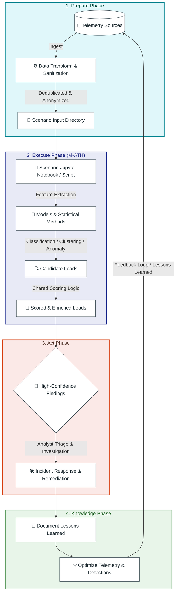
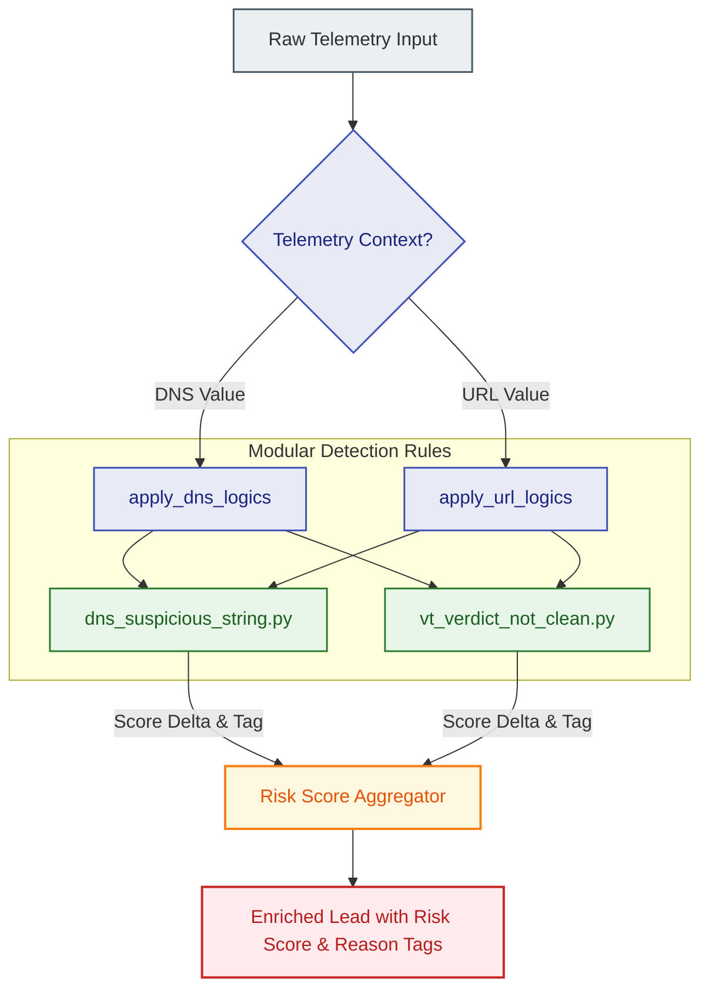

# Threat Hunting M-ATH Catalog

<p align="center">
  <a href="https://www.splunk.com/en_us/blog/security/peak-threat-hunting-framework.html"></a>
  <a href="https://www.virustotal.com/"></a>
  <a href="https://github.com/features/actions"></a>
  <br>
  <a href="https://github.com/PowerShell/PowerShell"></a>
  <a href="https://www.python.org/"></a>
  <a href="https://jupyter.org/"></a>
</p>

**Model-Assisted Threat Hunting (M-ATH)** — Algorithmically-driven Cyber Threat Hunting topics, aligned with the [Splunk PEAK Threat Hunting Framework](https://www.splunk.com/en_us/blog/security/peak-threat-hunting-framework.html).

This repository manages threat hunting scenarios that use machine learning and statistical methods — such as classification, clustering, anomaly detection, and time-series analysis — to surface leads that simpler signature-based methods miss.

---

## 🎯 Overview & PEAK Alignment

M-ATH is one of three hunt types in the PEAK Framework (*Prepare, Execute, and Act with Knowledge*). It uses algorithms to find leads for threat hunting, enabling more advanced and experimental hunts when:

- **Simpler methods aren't accurate enough** (e.g., dictionary-based DGA domains that blend in with legitimate traffic).
- **Classes of behavior (benign/malicious) can be labeled** (enabling supervised classification).
- **Data is high-volume or hard to summarize** (suited to dimensionality reduction and clustering).
- **Identification is confident but classification is difficult** (using an analyst-in-the-loop for final decisions).

> [!NOTE]
> **📖 Reference Materials & Guides**
> - [Introducing the PEAK Threat Hunting Framework](https://www.splunk.com/en_us/blog/security/peak-threat-hunting-framework.html)
> - [Model-Assisted Threat Hunting (M-ATH) with the PEAK Framework](https://www.splunk.com/en_us/blog/security/peak-framework-math-model-assisted-threat-hunting.html)
> - [The Threat Hunter's Cookbook](https://www.splunk.com/en_us/campaigns/threat-hunters-cookbook.html) (SURGe’s security experts guide; Forecasts p. 11, Clustering p. 14, Models p. 30/40)



---

## 📂 Core Components

### 1. Scenarios (M-ATH Topics)

All hunting scenarios are managed in the [scenarios/](./scenarios) directory, with metadata tracked in [scenarios/catalog.csv](./scenarios/catalog.csv).

| Category | Description / Approaches | Examples |
|---|---|---|
| **Classification** | Supervised classification of known malicious behaviors. | Dictionary DGA detection, malicious Base64 payloads, LOLBins |
| **Clustering** | Grouping high-dimensional data to surface outlier groups. | Process parent-child chains, user-agent injection |
| **Anomaly Detection** | Identifying statistical outliers in normal baselines. | DNS/URL anomalies, rare process behaviors |
| **Time-Series Analysis** | Surfacing patterns of periodic or seasonal deviations. | C2 beaconing (jittered), exfiltration, compromised accounts |

👉 View [scenarios/catalog.csv](./scenarios/catalog.csv) for the full list of use cases, datasets, and algorithms.

---

### 2. Detection Logics (Shared Scoring Rules)

The [detection_logics/](./detection_logics) package contains modular, reusable scoring and enrichment rules. Instead of hardcoding basic checks inside individual scenarios, notebooks delegate common checks to this shared package.



👉 Read the [Detection Logics README](./detection_logics/README.md) for details on active rules, scoring weights, and how to create new modules.

---

### 3. Data Transformation Utilities

Telemetry sanitization and preprocessing tools are provided in the [data_transform/](./data_transform) directory:
* **Data Anonymisation** ([data_anonymisation.py](./data_transform/data_anonymisation.py)): Strips sensitive information (domain logins, profile paths, usernames, computer names) from logs before ingestion.
* **Data Deduplication** ([data_deduplication.py](./data_transform/data_deduplication.py)): Performs fast, case-insensitive deduplication and numeric column aggregation (e.g., summing occurrences across identical rows).

👉 Refer to [data_transform/README.md](./data_transform/README.md) for CLI usage examples and configuration guides.

---

## ⚡ Quick Start

For full instructions, virtual environment settings, and Jupyter kernel configurations, see the [Local Setup & Development Guide](./docs/development.md).

### 🚀 Bootstrap in 2 Steps

#### 1. Setup JupyterLab
Create the central JupyterLab server environment under `.jupyter_venv`:
* **Windows (PowerShell):**
  ```powershell
  .\install\bootstrap_jupyter_venv.ps1
  ```
* **Linux/macOS:**
  ```bash
  python install/bootstrap_jupyter_venv.py
  ```

#### 2. Setup Scenario & Start
Create the isolated environment for a scenario (e.g., `process_clustering`), register its kernel, and start the JupyterLab server:
* **Windows (PowerShell):**
  ```powershell
  .\install\bootstrap_scenario_venv.ps1 -ScenarioPath scenarios\process_clustering
  .\scripts\start_jupyterlab.ps1
  ```
* **Linux/macOS:**
  ```bash
  chmod +x ./install/bootstrap_scenario_venv.sh
  ./install/bootstrap_scenario_venv.sh scenarios/process_clustering
  python scripts/start_jupyterlab.py
  ```

---

## 🛠️ Repository Architecture

| Component | Purpose | Details |
|---|---|---|
| **Local Environments** | Keep scenarios isolated using virtual environments registered as custom Jupyter kernels. | See [docs/development.md](./docs/development.md) |
| **GitHub Actions** | Daily validations checking folder structures, python compliance, and catalog synchronization. | See [docs/workflows.md](./docs/workflows.md) |
| **Development Security** | Git pre-commit hooks to verify telemetry is sanitized and no private keys are committed. | See [docs/development.md](./docs/development.md#git-pre-commit-hooks-development-security) |
| **Agentic Custom Skills** | Workspace-specific instructions guiding AI assistants to bootstrap, verify, and audit scenarios. | See [docs/custom_skills.md](./docs/custom_skills.md) |


<details>
<summary>📂 View Repository Directory Structure</summary>

```
├── .github/                       # GitHub Actions & validation helper scripts
│   ├── scripts/
│   │   ├── create_data_transform_issues.py
│   │   ├── create_missing_catalog_issues.py
│   │   ├── create_missing_scenarios_folder_issues.py
│   │   ├── find_missing_in_catalog.py
│   │   └── find_missing_scenarios_folders.py
│   └── workflows/
│       ├── check-catalog-sync.yml
│       ├── check-data-transform.yml
│       ├── check-scenarios-folders.yml
│       ├── download-confusables.yml
│       └── virustotal-high-confidence.yml
├── data_grabber/
│   └── sentinelone-powerquery/
│       ├── sentinelone_query.py   # SentinelOne PowerQuery collector
│       └── config.json            # Local query configuration
├── data_transform/                # Telemetry cleaning and deduplication utilities
│   ├── data_anonymisation.py
│   ├── data_anonymisation.input.example
│   └── data_deduplication.py
├── detection_logics/              # Shared scoring and enrichment helpers (reusable rule hits)
├── install/
│   ├── bootstrap_jupyter_venv.ps1 # Central JupyterLab environment bootstrap (Windows)
│   ├── bootstrap_jupyter_venv.py  # Central JupyterLab environment bootstrap (Python)
│   ├── bootstrap_scenario_venv.ps1 # Scenario-specific venv bootstrap & kernel registration (Windows)
│   ├── bootstrap_scenario_venv.sh # Scenario-specific venv bootstrap & kernel registration (Bash)
│   ├── install_dependencies.ps1   # Local dependency bootstrap
│   ├── install_dependencies.sh    # Linux/macOS dependency bootstrap
│   └── requirements.txt           # Shared Python dependencies
├── PEAK/                          # Reference material for the PEAK framework
├── scenarios/
│   ├── catalog.csv                # M-ATH use case catalog
│   ├── */README.md                # Scenario documentation
│   ├── */input/                   # Source telemetry or exported datasets
│   ├── */output/                  # Analysis outputs and ranked findings
│   └── */*.ipynb                  # Scenario notebooks where implemented
├── scripts/
│   ├── add_virustotal_verdicts.py
│   ├── bootstrap_scenarios.py
│   ├── fetch_sentinelone.py
│   ├── json_to_csv.py
│   ├── propose_scenario.py        # CLI helper to propose/bootstrap scenarios
│   ├── run_analysis.py
│   └── update_catalog_folders.py
└── scripts/                       # Utility and runner scripts
    ├── start_jupyterlab.ps1       # Runner to start central JupyterLab (Windows)
    └── start_jupyterlab.py        # Runner to start central JupyterLab (Python)
```
</details>

---

## 🤝 Contributing

We welcome contributions of new scenarios and detection rules! Please refer to the [Contributing Guide](docs/CONTRIBUTING.md) to learn how to propose, bootstrap, and test new hunts.