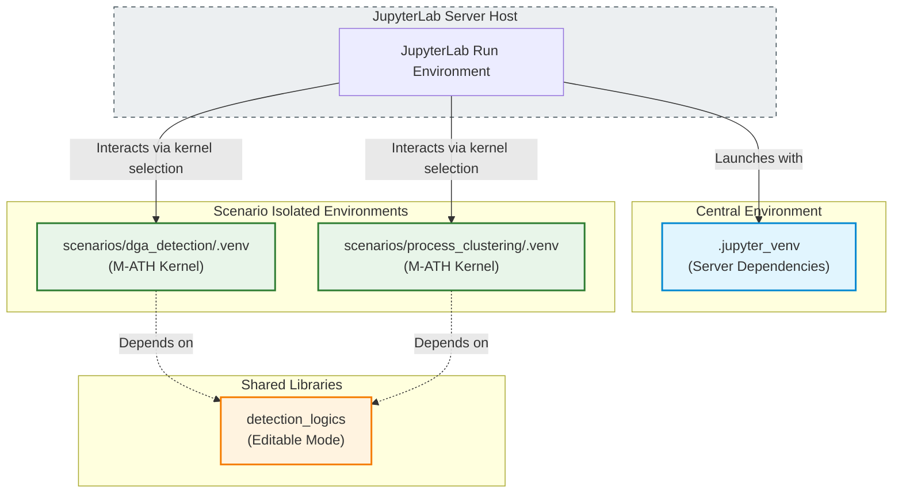

# Local Development & Setup

This guide describes how to configure your local environment, start JupyterLab, run helper scripts, and set up pre-commit compliance checks.

## JupyterLab Development Flow (Recommended)



Local notebooks are executed in scenario-isolated virtual environments to prevent dependency conflicts, and registered as custom kernels for JupyterLab:

1. **Bootstrap Central JupyterLab**:
   Install the central JupyterLab server environment under `.jupyter_venv`:
   * **Windows (PowerShell):**
     ```powershell
     .\install\bootstrap_jupyter_venv.ps1
     ```
   * **Linux/macOS:**
     ```bash
     python install/bootstrap_jupyter_venv.py
     ```

2. **Bootstrap Scenario Virtual Environment**:
   Create the scenario's isolated `.venv`, install the shared `detection_logics` package in editable mode (`pip install -e`), and register its custom Jupyter kernel (e.g., `M-ATH: dga_detection`):
   * **Windows (PowerShell):**
     ```powershell
     .\install\bootstrap_scenario_venv.ps1 -ScenarioPath scenarios\dga_detection
     ```
   * **Linux/macOS:**
     ```bash
     chmod +x ./install/bootstrap_scenario_venv.sh
     ./install/bootstrap_scenario_venv.sh scenarios/dga_detection
     ```

3. **Start JupyterLab**:
   Launch JupyterLab in headless mode:
   * **Windows (PowerShell):**
     ```powershell
     .\scripts\start_jupyterlab.ps1
     ```
   * **Linux/macOS:**
     ```bash
     python scripts/start_jupyterlab.py
     ```
   Copy the server URL and token from the console output, open it in your browser, load the scenario notebook (`.ipynb`), and select the registered `M-ATH: <scenario_name>` kernel from the top-right kernel dropdown.

---

## Scripts Execution (Alternative Local Setup)

To execute standalone helper Python scripts outside of JupyterLab:

* **Windows (PowerShell):**
  ```powershell
  .\install\install_dependencies.ps1
  ```
* **Linux/macOS:**
  ```bash
  chmod +x ./install/install_dependencies.sh
  ./install/install_dependencies.sh
  ```
For VirusTotal-enabled scripts, set `VT_API_KEY` in your environment.

---

## Git Pre-Commit Hooks (Development Security)

To prevent accidental commits of private telemetry or configurations, enable the pre-commit hook:

```bash
git config core.hooksPath .githooks
```
On Linux/macOS, make sure the hook script is executable:
```bash
chmod +x .githooks/pre-commit
```
