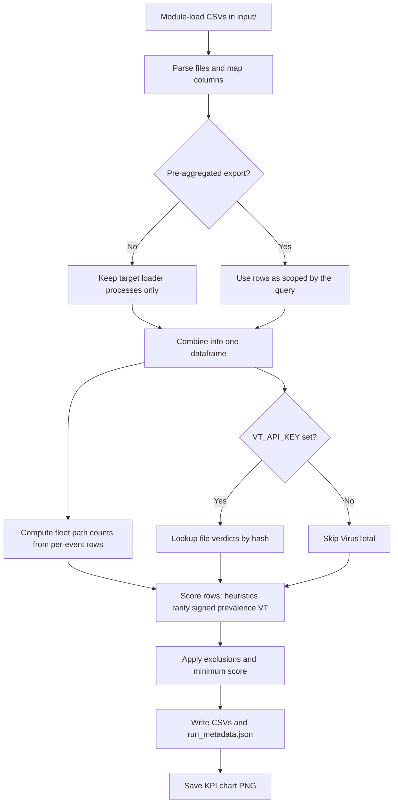

# Abnormal DLL loading in common applications

**Ref:** M25

## Description

This scenario supports threat hunting for **unusual DLL or module loads** inside high-prevalence user applications such as **Microsoft Teams**, **Microsoft Edge**, and other common IM or browser processes. The goal is to surface activity that may indicate **DLL side-loading**, **search-order hijacking**, or **blending malicious code with trusted application behavior**—patterns often associated with [MITRE ATT&CK T1574.002 (DLL Side-Loading)](https://attack.mitre.org/techniques/T1574/002/).

## M-ATH Sub-process

**Forecasting and Anomaly Detection** — Baseline typical image paths, publishers, and load frequency per process (or per application family), then flag rare paths, unsigned or low-prevalence binaries, and deviations from peer endpoints.

## PEAK Framework Alignment

This scenario follows the **PEAK Threat Hunting Framework** ([Splunk](https://www.splunk.com/en_us/blog/security/peak-framework-math-model-assisted-threat-hunting.html)) using **Model-Assisted Threat Hunting (M-ATH)**.

| Phase | Focus | Notebook sections |
|-------|-------|-------------------|
| **Prepare** | Select topic, research, identify datasets, select algorithms | Environment setup, imports, scoring/exclusion helpers, target process list |
| **Execute** | Gather data, pre-process, apply model, analyze, escalate | Module telemetry loading, fleet-rarity scoring, VT hash lookup, exclusion filtering |
| **Act** | Document findings, preserve hunt, create detections/playbooks | Results/top-100 export, run metadata, KPI chart |
| **Knowledge** | Continuous improvement, communicate findings, feed back into next run | Update exclusions, expand target processes, refine path heuristics |

## Principle

Trusted applications load many legitimate DLLs from well-known directories. Attackers may place malicious DLLs where the loader resolves them first (application folder, user-writable paths, or `PATH` abuse), or abuse predictable load order. Focusing hunts on **common apps** reduces noise from one-off tools and highlights loads that are **unexpected for that process name** across the fleet.

## Folder layout

| Path           | Purpose                                                         |
| -------------- | --------------------------------------------------------------- |
| `input/`       | CSV exports from EDR/SIEM (module/image load telemetry)         |
| `output/`      | Ranked findings, summaries, and charts produced by analysis     |
| `exclusions/`  | Optional suppression lists for known benign DLL paths or hashes |
| `.env.example` | Template for optional API keys if enrichment is added later     |


## Data Needed

- **EDR** module or image-load events (process image, loaded module path, signer, hash if available)
- **Sysmon** Event ID 7 (Image loaded), if centrally collected
- **Windows** telemetry that ties **loading process** to **loaded image** with a stable timestamp and host identifier

## Data Collection — Initial Query

Export telemetry where the **parent or loading process** matches high-value baselines, for example:

- `ms-teams.exe`, `Teams.exe`
- `msedge.exe`, `chrome.exe` (if in scope)
- Other IM/browser binaries your organization standardizes on

Filter or pivot on **loaded image path** not under expected vendor directories, **unsigned** modules where signing is expected, or **first-seen** DLL paths for that process name.

### Example queries (adapt columns and indexes)

**SentinelOne PowerQuery (illustrative)**

```sql
event.type = "Module Load" and src.process.name in ("Teams.exe","msedge.exe")
| columns tgt.file.path, tgt.file.sha256, src.process.image.path, endpoint.name, timestamp
```

or for focusing on Microsoft Edge executed on Windows 

```sql
| filter event.type == 'Module Load' AND src.process.name in:anycase("msedge.exe") AND endpoint.type = 'laptop' AND endpoint.os = 'windows'
| group count() by module.path, module.sha1
| sort +"count()" 
```

**Splunk SPL (Sysmon EID 7, illustrative)**

```
index=sysmon EventCode=7 ImageLoaded="*" (Image="*\\Teams.exe" OR Image="*\\msedge.exe")
| table _time, Computer, Image, ImageLoaded, Signed, Signature
```

**Microsoft Sentinel (KQL) — DeviceImageLoadEvents**

```kql
DeviceImageLoadEvents
| where InitiatingProcessFileName in~ ("teams.exe", "msedge.exe", "ms-teams.exe")
| project Timestamp, DeviceName, InitiatingProcessFileName, FolderPath, FileName, SHA256
```

> Normalize process names and paths to your data model (`InitiatingProcess*`, `process.name`, etc.).

## Input

Place exported CSV files under `input/`. A small **`input/sample_module_loads.csv`** illustrates Sysmon-style columns (`Image`, `ImageLoaded`, `SHA256`, `Signed`, `Computer`).

## What the notebook does

The notebook `abnormal_dll_loading_common_applications.ipynb` follows the same execution pattern as `punycode_encoded_international_domain_names/punycode_idn.ipynb`:

1. **Resolve paths** — Walks up from the working directory to find the repository root (`detection_logics/` + `scenarios/`), sets `scenarios/abnormal_dll_loading_common_applications/` as the scenario folder, adds the repo root to `sys.path`, and ensures `output/` exists.
2. **Merge exclusions** — Loads `exclusions/excluded_values.conf` and `exclusions/excluded_values+reasons.conf` from **both** the repository root and this scenario folder, then unions the entries (same conf format as other scenarios).
3. **Load CSVs (per file)** — Reads each `*.csv` under `input/` recursively, adds `_source_file`, and detects one of two shapes:
   - **Per-event / EDR row:** loading process (`Image`, `src.process.image.path`, …), loaded module (`ImageLoaded`, `tgt.file.path`, …), optional hash (`SHA256`, `module.sha1`, …), optional **Signed**, **hostname**.
   - **Aggregated Power Query** (e.g. SentinelOne): columns `module.path`, `module.sha1`, `count()` — **no** process column. The notebook treats this as *pre-filtered aggregate* (filter to Teams/Edge in the Power Query itself). Rarity uses the **`count()`** value (not duplicate rows in the CSV).
4. **Filter processes** — For per-event exports only: keeps rows whose loading process basename is in `TARGET_PROCESS_NAMES` (editable: `teams.exe`, `ms-teams.exe`, `msedge.exe`, `chrome.exe`, `outlook.exe`). Aggregate exports skip this step.
5. **Score** — Rule-based score: temp/download paths, user-profile non-vendor paths, high file-name entropy; for per-event data, **fleet rarity** within non-aggregate rows plus optional **prevalence** column; for aggregate data, **`count()` ≤ `LOW_PREVALENCE_THRESHOLD`**; optional unsigned flag; optional **VirusTotal** file verdict when `VT_API_KEY` is set (MD5, SHA-1, or SHA-256).
6. **Threshold** — Keeps rows with total score ≥ 2 after exclusions (`SCORE_THRESHOLD`, `LOW_PREVALENCE_THRESHOLD`).
7. **Export** — Writes CSV results, `run_metadata.json`, a four-panel KPI PNG, and displays the chart inline.



## Prerequisites

- Install dependencies from `install/requirements.txt`
- JupyterLab or Jupyter Notebook
- Optional: copy `.env.example` to `.env` and set `VT_API_KEY` for SHA-256 lookups against the VirusTotal files API (skipped if the key is missing)

## Output

| File | Description |
|------|-------------|
| `output/abnormal_dll_loading_results.csv` | Ranked findings: `aggregate_export`, loading process (or placeholder for aggregate), module path, `fleet_row_count`, `prevalence_value`, `file_hash`, signed, hostname, score, reasons, optional VT fields, `source_file` |
| `output/abnormal_dll_loading_top100.csv` | Up to 100 highest-scoring rows (same schema) |
| `output/abnormal_dll_loading_kpis.png` | Charts: top loading basenames, score distribution, top reasons, VT verdict mix |
| `output/run_metadata.json` | Row counts, finding count, threshold, whether a VT key was present |

## How to Run

1. Collect module/image load telemetry for Teams, Edge, or other in-scope applications (see **Data Collection**).
2. Export to CSV and place files in `input/` (or run against `sample_module_loads.csv`).
3. Add known benign DLL paths to `exclusions/excluded_values.conf` (repo or scenario) as needed.
4. Open `abnormal_dll_loading_common_applications.ipynb` and run all cells.
5. Review `output/abnormal_dll_loading_results.csv` and the KPI figure.

For pipeline execution (GitHub Actions), see the main [README](../../README.md).

## Atomic Red Team Tests

| Test Name | Test ID | Platform | Identified Date | Human Confirmed |
| --- | --- | --- | --- | --- |
| DLL Search Order Hijacking - amsi.dll | 8549ad4b-b5df-4a2d-a3d7-2aee9e7052a3 | windows | 2026-07-14 | No |
| Phantom Dll Hijacking - WinAppXRT.dll | 46ed938b-c617-429a-88dc-d49b5c9ffedb | windows | 2026-07-14 | No |
| Phantom Dll Hijacking - ualapi.dll | 5898902d-c5ad-479a-8545-6f5ab3cfc87f | windows | 2026-07-14 | No |
| DLL Side-Loading using the Notepad++ GUP.exe binary | 65526037-7079-44a9-bda1-2cb624838040 | windows | 2026-07-14 | No |
| DLL Side-Loading using the dotnet startup hook environment variable | d322cdd7-7d60-46e3-9111-648848da7c02 | windows | 2026-07-14 | No |
| DLL Search Order Hijacking,DLL Sideloading Of KeyScramblerIE.DLL Via KeyScrambler.EXE | c095ad8e-4469-4d33-be9d-6f6d1fb21585 | windows | 2026-07-14 | No |
| DLL Search Order Hijacking - ntprint | e96b8105-d7f7-484e-8d81-2d0c7086971b | windows | 2026-07-24 | No |
