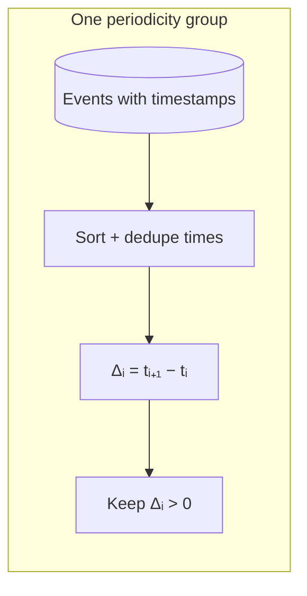
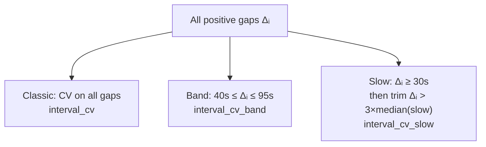
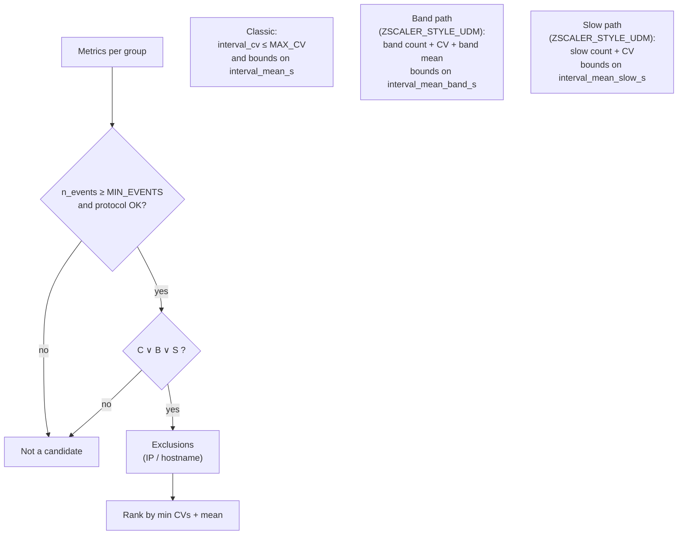
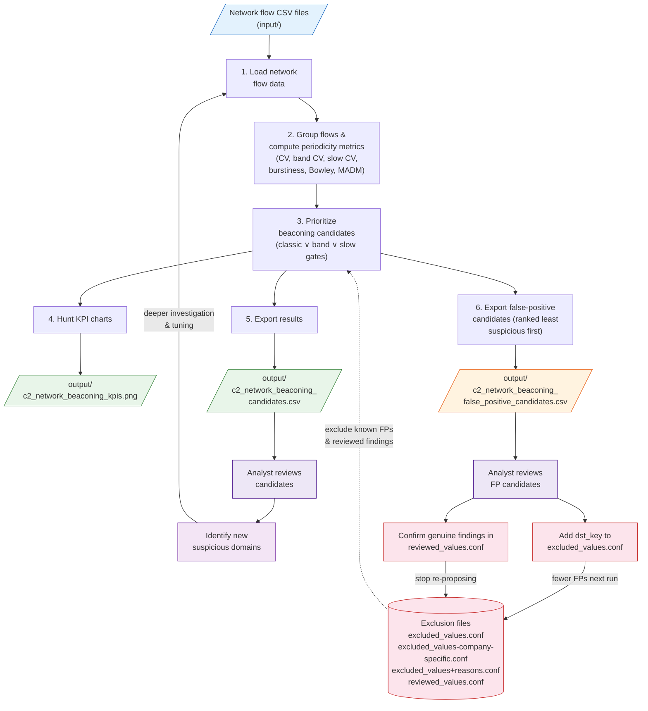

# Detection of C&C network beaconing

**Ref:** M12

## Description

This scenario tests a threat-informed hypothesis to separate adversarial command-and-control beaconing from legitimate periodic traffic. It is intended for beaconing behaviors over protocols such as HTTP(S), named pipes, SMB, or other channels where attackers use periodic or near-periodic communication to maintain access.

## M-ATH Sub-process

**Forecasting and Anomaly Detection** - Identify periodic or near-periodic communications that deviate from normal service traffic.

## PEAK Framework Alignment

This scenario follows the **PEAK Threat Hunting Framework** ([Splunk](https://www.splunk.com/en_us/blog/security/peak-framework-math-model-assisted-threat-hunting.html)) using **Model-Assisted Threat Hunting (M-ATH)**. The notebook is structured around the four PEAK phases:

| Phase | Focus | Notebook sections |
|-------|-------|-------------------|
| **Prepare** | Select topic, research, identify datasets, select algorithms | Environment setup, imports, exclusion loading, interval regularity math |
| **Execute** | Gather data, pre-process, apply model, analyze, escalate | Flow loading, periodicity grouping, CV/burstiness metrics, candidate prioritization |
| **Act** | Document findings, preserve hunt, create detections/playbooks | KPI charts, candidate CSV export, false-positive candidate triage |
| **Knowledge** | Continuous improvement, communicate findings, feed back into next run | Tune thresholds, update exclusions, track detection maturity across runs |

## Detection logic and mathematics

This hunt treats each **periodicity group** (one logical client-to-destination “series” after grouping; see **Method**) as a **time-ordered point process**: connection or flow events at times $t_1 < t_2 < \cdots < t_n$. The hypothesis is that **command-and-control beaconing** often produces **many similar gaps** between successive events, while much legitimate traffic is **bursty** or **irregular**, which shows up as **higher relative spread** in those gaps (larger $\mathrm{CV}$; see below).

### Step 1 — Build one timeline per group

Within each group, events are sorted by timestamp. **Duplicate timestamps** for the same instant are dropped so each time appears once before differencing. The **inter-arrival gaps** (in seconds) are:

$$
\Delta_i = t_{i+1} - t_i,\quad i = 1,\ldots,n-1
$$

Only **strictly positive** gaps are kept ($\Delta_i > 0$); zero or negative gaps (clock or ordering artifacts) are removed. If too few gaps remain, the group is skipped.



### Step 2 — Classical regularity: $\mu$, $\sigma$, and $\mathrm{CV}$

Let $\{\Delta_i\}$ be the kept gaps for that group. The notebook uses **population** standard deviation (`ddof=0`):

$$
\mu = \frac{1}{N}\sum_{i=1}^{N} \Delta_i,\qquad
\sigma = \sqrt{\frac{1}{N}\sum_{i=1}^{N}(\Delta_i - \mu)^2}
$$

The **coefficient of variation** is the **jitter relative to the typical spacing**:

$$
\mathrm{CV} = \frac{\sigma}{\mu}\quad(\mu > 0)
$$

**Interpretation:** If check-ins happen every $\sim\!60\,\mathrm{s}$ with small drift, $\sigma$ is small compared to $\mu$, so $\mathrm{CV}$ is **low**. If gaps mix tiny and huge values (typical of interactive browsing mixed with background calls), $\sigma$ is large compared to $\mu$, so $\mathrm{CV}$ is **high**. The **classic** rule flags flows with **low** $\mathrm{CV}_{\mathrm{all}}$ (column `interval_cv`), subject to event-count and mean-interval bounds (defaults in the notebook).

We write $\mathrm{CV}_{\mathrm{all}}$ for the coefficient of variation computed on **all** positive gaps; helper variants below reuse the same $\mu,\sigma,\mathrm{CV}$ definition on restricted subsets.

**Burstiness** (reported as `burstiness`) is a complementary one-number summary common in human-dynamics literature:

$$
B = \frac{\sigma - \mu}{\sigma + \mu}\quad(\sigma + \mu > 0)
$$

Very regular spacing ($\sigma \ll \mu$) drives $B$ toward **negative** values; heavy-tailed, bursty spacing tends toward **positive** $B$. It is **not** the primary gate for flagging here, but it helps analysts compare shape at a glance.

### Supplemental timing columns (always computed)

On the **same** positive gaps $\{\Delta_i\}$, the notebook also exports:

- **Bowley skew** (`interval_bowley_skew`): Let $Q_{20}, Q_{50}, Q_{80}$ be the 20th, 50th, and 80th percentiles of $\{\Delta_i\}$. With $N = Q_{20} + Q_{80} - 2Q_{50}$ and $D = Q_{80} - Q_{20}$, use $N/D$ when $D \neq 0$ and $Q_{50}$ differs from both $Q_{20}$ and $Q_{80}$; otherwise **0** (same edge cases as [RITA-J](https://github.com/Cyb3r-Monk/RITA-J) timing skew). Symmetric gap distributions yield skew **near zero**.
- **Median absolute deviation from the median** (`interval_madm_s`): $\mathrm{MADM} = \mathrm{median}_i\bigl|\Delta_i - \mathrm{median}(\Delta)\bigr|$ — robust spread vs. $\sigma$.
- **Events per hour** (`events_per_hour`): $n_{\mathrm{events}} \big/ \max\{\epsilon,\,(t_n - t_1)/3600\,\mathrm{h}\}$ using first and last event time in the group (after deduplication). If the span is non-positive, the value is **not finite**.

These columns are **always** present in `flows_df` / the CSV. **Default** candidate rules and **ranking** still rely on $\mathrm{CV}$ paths unless you enable the optional flags below.

### Step 3 — Why “band” and “slow” $\mathrm{CV}$ exist (mixed timescales)

On **dense HTTP/S proxy logs**, a single group can contain **sub-second** requests (page assets, retries) **and** **minute-scale** beacon-like gaps. The **raw** $\mathrm{CV}_{\mathrm{all}}$ then blends two scales and can look **meaningless or overly high** even when a steady $\sim\!60\,\mathrm{s}$ check-in train is present.

To surface that hidden regularity **without** hand-picking hostnames, the notebook computes two **helper** subsets of the positive gaps $\{\Delta_i\}$, then applies the same $\mu,\sigma,\mathrm{CV}$ formulas to each subset.

**Band (minute-scale window).** Fix bounds $L_{\mathrm{b}}, U_{\mathrm{b}}$ (defaults $L_{\mathrm{b}}=40\,\mathrm{s}$, $U_{\mathrm{b}}=95\,\mathrm{s}$). Define

$$
\mathcal{I}_{\mathrm{b}} = \{\, i : L_{\mathrm{b}} \le \Delta_i \le U_{\mathrm{b}} \,\}.
$$

Let $\mathrm{CV}_{\mathrm{b}}$ be $\sigma/\mu$ on $\{\Delta_i : i \in \mathcal{I}_{\mathrm{b}}\}$ when $|\mathcal{I}_{\mathrm{b}}|\ge 2$. Column: `interval_cv_band`.

**Slow + median trim.** Let $\mathcal{I}_{\mathrm{s}} = \{\, i : \Delta_i \ge 30\,\mathrm{s} \,\}$. Let $m = \mathrm{median}\{\Delta_i : i \in \mathcal{I}_{\mathrm{s}}\}$ and

$$
\mathcal{I}_{\mathrm{s}}' = \{\, i \in \mathcal{I}_{\mathrm{s}} : \Delta_i \le 3m \,\}.
$$

Let $\mathrm{CV}_{\mathrm{s}}$ be $\sigma/\mu$ on $\{\Delta_i : i \in \mathcal{I}_{\mathrm{s}}'\}$ when $|\mathcal{I}_{\mathrm{s}}'|\ge 2$. Column: `interval_cv_slow`. Trimming drops extreme long idle gaps so they do not dominate $\sigma$.



### Step 4 — From metrics to candidates (gates)

Every group first earns **per-flow metrics** (counts, means, $\mathrm{CV}_{\mathrm{all}},\,\mathrm{CV}_{\mathrm{b}},\,\mathrm{CV}_{\mathrm{s}}$, burstiness $B$, time span). Let $T_{\min}, T_{\max}$ denote the hunt parameters `MIN_MEAN_S` and `MAX_MEAN_S`, and let $c, c_{\mathrm{b}}, c_{\mathrm{s}}$ denote `MAX_CV`, `MAX_CV_BAND`, and `MAX_CV_SLOW` (defaults in the notebook). Write $\mu_{\mathrm{all}}, \mu_{\mathrm{b}}, \mu_{\mathrm{s}}$ for the means of the **all-gap**, **band**, and **slow-trimmed** series (`interval_mean_s`, `interval_mean_band_s`, `interval_mean_slow_s`).

A row becomes a **candidate** only if:

- $n_{\mathrm{events}} \ge \texttt{MIN\_EVENTS}$ (default $5$) and the protocol passes exclusions.
- **At least one** path holds (each path binds $T_{\min}, T_{\max}$ to its **own** mean $\mu_{\mathrm{all}}$, $\mu_{\mathrm{b}}$, or $\mu_{\mathrm{s}}$):

$$
\begin{aligned}
\text{Classic:}\quad
  & \mathrm{CV}_{\mathrm{all}} \le c \;\land\; T_{\min} \le \mu_{\mathrm{all}} \le T_{\max} \\[0.35em]
\text{Band (Zscaler-style only):}\quad
  & |\mathcal{I}_{\mathrm{b}}| \ge N_{\mathrm{b}} \;\land\; \mathrm{CV}_{\mathrm{b}} \le c_{\mathrm{b}} \;\land\; T_{\min} \le \mu_{\mathrm{b}} \le T_{\max} \\
  & \quad \land\; 0.75\,L_{\mathrm{b}} \le \mu_{\mathrm{b}} \le 1.25\,U_{\mathrm{b}} \\[0.35em]
\text{Slow (Zscaler-style only):}\quad
  & |\mathcal{I}_{\mathrm{s}}| \ge N_{\mathrm{s}} \;\land\; \mathrm{CV}_{\mathrm{s}} \le c_{\mathrm{s}} \;\land\; T_{\min} \le \mu_{\mathrm{s}} \le T_{\max}
\end{aligned}
$$

Defaults in the notebook: $N_{\mathrm{b}} = N_{\mathrm{s}} = 25$, $c_{\mathrm{b}} = 0.38$, $c_{\mathrm{s}} = 0.42$.

Preset values: $c = 0.36$ for generic / Zscaler-style inputs, $c = 0.62$ when **`UDM_INPUT_MODE`** is on without Zscaler-style columns; $T_{\max} = 7200\,\mathrm{s}$; $T_{\min} = 0.01\,\mathrm{s}$ generic or $0.001\,\mathrm{s}$ relaxed UDM-only (see notebook).

So a flow can qualify on **band** or **slow** even when $\mu_{\mathrm{all}}$ is dominated by sub-second traffic, as long as that path’s $\mu$ and $\mathrm{CV}$ pass.

**Exclusions** then remove rows whose `dst_ip` or `dst_hostname_sample` matches configured values (repository + scenario `exclusions/`).

**Ranking (default):** Let $\mathcal{C} = \{\mathrm{CV}_{\mathrm{all}}\} \cup \{\mathrm{CV}_{\mathrm{b}} : \text{finite}\} \cup \{\mathrm{CV}_{\mathrm{s}} : \text{finite}\}$. Candidates are sorted by $\min \mathcal{C}$ (**lower** is more regular), then by mean interval.

**Optional:** With **`USE_RITA_STYLE_RANKING`** in the prioritize cell, ordering uses a **blend** of $\min \mathcal{C}$ and a $[0,1]$ timing score (mean of clipped $1-| \text{Bowley} |$, $1 - \mathrm{MADM}/30\,\mathrm{s}$, and RITA-like density $\min(1,\, n_{\mathrm{events}} / \max\{\mathrm{span}/90\,\mathrm{s},\epsilon\})$). **`RITA_RANK_BLEND_WEIGHT`** controls how strongly that score pulls the sort; **`USE_RITA_STYLE_GATES`** adds **extra** conjunctive thresholds on |Bowley|, MADM, and `events_per_hour` before exclusions. Both flags default to **off**.



### Important caveats

Thresholds are **tunable hunt parameters**, not ground truth. **Low** $\mathrm{CV}$ means “statistically regular spacing,” which includes benign schedulers, health checks, and software update cadences. **Investigation** (host, process, destination ownership, reputation) is required to turn a candidate into a finding.

## Related work and design choices

Community tools such as [RITA](https://activecountermeasures.com/) (Real Intelligence Threat Analytics) and the Jupyter port [RITA-J](https://github.com/Cyb3r-Monk/RITA-J) popularize **beacon hunting** from connection or HTTP logs using **quartile-based skew**, **MADM on inter-arrival gaps**, **connection density**, and (for HTTP) **payload-size regularity**. Those approaches are effective on Zeek-style exports and similar schemas.

**This scenario deliberately centers on a different core signal:** **coefficient of variation** $\mathrm{CV}=\sigma/\mu$ on inter-arrival gaps, with **Zscaler-aware periodicity keys** (hostname + egress identity, omitting rotating backend IPs) and **band / slow-trimmed** $\mathrm{CV}$ paths so dense HTTP/S proxy logs do not drown minute-scale beacons in sub-second noise. That design targets **Chronicle UDM–style** and **egress-NAT** telemetry more directly than classic RITA grouping.

We still **surface RITA-family statistics** (`interval_bowley_skew`, `interval_madm_s`, `events_per_hour`) for analysts and for **optional** gates/ranking (`USE_RITA_STYLE_*`), so teams can compare or combine perspectives without abandoning the CV-first pipeline. RITA-J’s **payload-size** scoring is **not** replicated here: it requires consistent byte-length columns that are not guaranteed across UDM exports.

## Method

1. **Load** - Read network telemetry from `input/` (see **Input**). Column names are auto-detected for common SIEM and Chronicle UDM / Zscaler-style exports.
2. **Group** - Build a **periodicity key** per logical series, then sort events by time within each key:
   - **Default (non–Zscaler-style):** `(flow_src, dst_ip, dst_port, protocol)` where `flow_src` is endpoint identity if present, otherwise source IP.
   - **Zscaler-style UDM** (`udm.principal.nat_ip` + `udm.network.application_protocol`) **with a non-empty target hostname:** `(flow_src, hostname, dst_port, protocol)`. **`udm.target.ip` is omitted** so many resolved/backend IPs for the same SNI (CDN, load balancing) stay in **one** series **per egress NAT**. **`flow_src` is included** so different egress NATs do not interleave into one jittery timeline.
   - **Zscaler-style without hostname:** `(flow_src, dst_ip, dst_port, protocol)`.
3. **Measure** - Positive inter-arrival gaps $\Delta_i$ (seconds). **Coefficient of variation** $\mathrm{CV}_{\mathrm{all}} = \sigma/\mu$ on all gaps; **burstiness** $B = (\sigma - \mu)/(\sigma + \mu)$; **Bowley skew**, **MADM**, and **events per hour** on the same gaps (see **Supplemental timing columns**); plus helper series for prioritization: $\mathrm{CV}_{\mathrm{b}}$ on gaps with $L_{\mathrm{b}} \le \Delta_i \le U_{\mathrm{b}}$ (defaults $40\,\mathrm{s} \le \Delta_i \le 95\,\mathrm{s}$) and $\mathrm{CV}_{\mathrm{s}}$ on slow gaps $\Delta_i \ge 30\,\mathrm{s}$ after trimming $\Delta_i > 3m$ with $m$ the median of those slow gaps. **`n_distinct_dst_ip`** counts distinct destination IPs in the group (triage for CDN-style backends).
4. **Prioritize** - Rows must meet `MIN_EVENTS`, mean-interval bounds (`MIN_MEAN_S` / `MAX_MEAN_S` on the mean tied to each path), and protocol exclusions. Qualification is **disjunctive**: $\text{classic} \lor \text{band} \lor \text{slow}$ — **classic** $\mathrm{CV}_{\mathrm{all}} \le \texttt{MAX\_CV}$ (default **0.36** Zscaler-style, **0.62** sparse UDM-only `UDM_INPUT_MODE`); **band** and **slow** paths apply only when `ZSCALER_STYLE_UDM`, using $\mathrm{CV}_{\mathrm{b}}$, $\mathrm{CV}_{\mathrm{s}}$, interval counts, and band-mean windows as in **Detection logic and mathematics**. Exact constants (`MAX_CV_BAND`, `MAX_CV_SLOW`, $N_{\mathrm{b}}$, $N_{\mathrm{s}}$, $L_{\mathrm{b}}$, $U_{\mathrm{b}}$) are in the prioritize cell of the notebook. **Optional:** `USE_RITA_STYLE_GATES` / `USE_RITA_STYLE_RANKING` (default **False**) tighten or re-rank using Bowley, MADM, and density; tune `MAX_ABS_BOWLEY_SKEW`, `MAX_INTERVAL_MADM_S`, `MIN_EVENTS_PER_HOUR`, `RITA_RANK_BLEND_WEIGHT` in the same cell. **Exclusions:** merged repository `exclusions/` and this scenario’s `exclusions/` drop candidates when `dst_ip` or `dst_hostname_sample` matches a configured value.
5. **Investigate** - Validate suspicious flows with host, process, destination, and reputation context.

## Data Needed

- Network flow or connection logs with timestamps, source and destination identifiers, protocol, and port
- Optional host-process context and destination enrichment for triage

## Data Collection - Initial Query

Export network telemetry over a time window long enough to reveal periodic communication patterns. Preserve timestamps at sufficient granularity to measure repeated intervals accurately.

## Input

Place network flow or connection exports in `input/`. Retain source, destination, protocol, port, and event time for each record.

**Chronicle UDM (incl. Zscaler-forwarded HTTP/S):** The notebook recognizes `timestamp`, `udm.target.ip`, optional `udm.principal.nat_ip` (user egress), `udm.network.application_protocol` (HTTP/HTTPS), optional `udm.target.asset.hostname`, and optional HTTP method / user-agent columns when present. If no L4 port column exists, **80** and **443** are inferred from the application protocol.

**Primary inputs:** With `PRIMARY_INPUT_CSV = None`, the notebook loads **every `*.csv` file** under `input/` **recursively** (sorted by path) and concatenates them. Set **`PRIMARY_INPUT_CSV`** to a single filename under `input/` to restrict the run to one export.

### Warning: egress NAT, hostnames, and grouping

Many HTTP/S exports show the client as a **NAT or proxy egress IP** (e.g. `udm.principal.nat_ip`), not a stable host identity. That address can **change** over time (pool rotation, failover). If you group only on “this source IP → this destination IP,” one steady beacon can split into several short, jittery series.

When the export carries a **target hostname** and matches **Zscaler-style** columns, the notebook groups by **`(flow_src, hostname, dst_port, protocol)`** so that:

- **Rotating backend IPs** for the same hostname do not fragment the series (destination IP is not part of the key).
- **Different egress NATs** remain **separate** series, so independent beacons to the same hostname are not interleaved in time order (which would inflate $\mathrm{CV}_{\mathrm{all}}$).

If there is **no** usable hostname, grouping falls back to keys that include **`dst_ip`** and depend on **`flow_src`** / source identity as detected by the loader.

**Check your inputs:**

- Use a **time window long enough** for many check-ins per logical flow (tune `MIN_EVENTS` and thresholds in the notebook if your export is short).
- Prefer exports that include **`udm.target.asset.hostname`** (or equivalent) when traffic is proxied.
- If you merge multiple CSVs, avoid truncating the window so severely that statistics are unstable.

## Prerequisites

- Install shared dependencies from `install/requirements.txt`
- Run the hunt notebook `c2_network_beaconing.ipynb` in this folder (see **How to Run**)

## Output

| File | Description |
|------|-------------|
| `output/c2_network_beaconing_candidates.csv` | Ranked flows: identity (`flow_src`, `n_distinct_nat`, `src_nat_ips`, `src_ip_sample`), destination (`dst_ip`, **`n_distinct_dst_ip`**, `dst_port`, `protocol`, `dst_hostname_sample`, `http_method_sample`), counts and timing (`n_events`, `n_intervals`, `interval_mean_s`, `interval_median_s`, `interval_std_s`, **`interval_cv`**, **`n_intervals_band`**, **`interval_mean_band_s`**, **`interval_cv_band`**, **`n_intervals_slow`**, **`interval_mean_slow_s`**, **`interval_cv_slow`**, `interval_min_s`, `interval_max_s`, `burstiness`, **`interval_bowley_skew`**, **`interval_madm_s`**, **`events_per_hour`**, `first_seen`, `last_seen`), **`rank`**. |
| `output/c2_network_beaconing_false_positive_candidates.csv` | All candidates enriched with **`dst_key`** (destination hostname or IP), sorted by rank descending (least suspicious first). Entries whose `dst_key` appears in `exclusions/reviewed_values.conf` are removed so confirmed genuine threats are not re-proposed for exclusion. |
| `output/c2_network_beaconing_kpis.png` | Summary charts ($\mathrm{CV}$ distribution, scatter, top candidates by best-of $\mathrm{CV}_{\mathrm{all}}/\mathrm{CV}_{\mathrm{b}}/\mathrm{CV}_{\mathrm{s}}$, run stats, timeline). |
| `output/` | Any additional exports you add during analysis |

## Exclusion files

| File | Purpose |
|------|---------|
| `exclusions/excluded_values.conf` | Destination IPs or hostnames to **exclude** from candidates entirely (one per line; comments start with `#`). Contains generic domains (Microsoft, Google, Apple, security vendors, etc.) that are not organisation-specific. |
| `exclusions/excluded_values-company-specific.conf` | **Organisation-specific** destination IPs or hostnames to exclude (corporate domains, subsidiaries, internal suffixes). **Not committed to the repository** (listed in `.gitignore`). Create it from the provided example file before running the notebook. |
| `exclusions/excluded_values-company-specific.conf.example` | Template for the company-specific exclusions file. Copy it to `excluded_values-company-specific.conf` and replace the placeholder entries with your organisation's domains. |
| `exclusions/excluded_values+reasons.conf` | Value + reason pairs (`<value> \|\| <reason>`) for conditional exclusions. |
| `exclusions/reviewed_values.conf` | Destination IPs or hostnames that have been **reviewed and confirmed as genuine findings** — not false positives. Listed values are removed from `c2_network_beaconing_false_positive_candidates.csv` so they are not re-proposed for exclusion on subsequent runs. |

Repository-level exclusion files under the top-level `exclusions/` folder are merged with scenario-level files.

> **First-time setup:** copy the example file and populate it with your organisation's domains before the first run:
> ```bash
> cp scenarios/detection_of_c2_network_beaconing/exclusions/excluded_values-company-specific.conf.example \
>    scenarios/detection_of_c2_network_beaconing/exclusions/excluded_values-company-specific.conf
> ```
> Without this file the notebook will print a warning and skip company-specific exclusions, which may produce more false-positive candidates.

## Reviewing false-positive candidates

Beaconing candidates are not always C2 — many will be benign scheduled services. The notebook exports **`output/c2_network_beaconing_false_positive_candidates.csv`** to help triage.

### Workflow

1. **Run the notebook** — the false-positive candidates file is generated automatically after the main candidates CSV.
2. **Open `c2_network_beaconing_false_positive_candidates.csv`** — entries are sorted by rank descending (least suspicious first). The **`dst_key`** column shows the primary destination identifier (hostname or IP) you would add to an exclusion list.
3. **For each destination, decide:**
   - **True false positive** (benign scheduled traffic, health check, software update): add the `dst_key` value to **`exclusions/excluded_values.conf`**. The destination will be excluded from candidates on the next run.
   - **Genuine finding** (confirmed or suspected C2): add the `dst_key` value to **`exclusions/reviewed_values.conf`**. The destination stays in candidates but will no longer appear in the false-positive candidates file.
   - **Unsure / needs more investigation**: leave it for the next review cycle.
4. **Re-run the notebook** — previously reviewed destinations no longer clutter the false-positive candidates file.

## How to Run

1. Export network telemetry into `input/` (any number of `.csv` files; all are loaded when `PRIMARY_INPUT_CSV` is `None`).
2. Open and run `c2_network_beaconing.ipynb` from the repository root or scenario folder (the notebook sets paths from the notebook location).
3. Review `output/c2_network_beaconing_candidates.csv` with protocol, destination, host context, and the band/slow columns when raw `interval_cv` is high but Zscaler alternate rules fired.
4. Review `output/c2_network_beaconing_false_positive_candidates.csv` and update `exclusions/excluded_values.conf` (false positives) or `exclusions/reviewed_values.conf` (genuine findings) accordingly.

For pipeline execution (GitHub Actions), see the main [README](../../README.md).

---

## Overall process

The diagram below shows the notebook execution pipeline and how each run feeds back into the next one to reduce false positives and surface more genuine C2 beaconing.



**Continuous improvement loop:** after each execution, the analyst reviews the two output files to feed improvements back into the next run:

| Review output | What to look for | Action for next run |
|---|---|---|
| `c2_network_beaconing_candidates.csv` | New suspicious domains or IPs with low CV that warrant investigation | Investigate hosts, processes, and destination ownership; tune thresholds or add confirmed benign destinations to exclusions |
| `c2_network_beaconing_false_positive_candidates.csv` | Destinations confirmed as benign scheduled traffic (health checks, software updates, telemetry) | Add their `dst_key` to `exclusions/excluded_values.conf` to suppress them in future runs |
| `c2_network_beaconing_false_positive_candidates.csv` | Destinations that look genuinely suspicious and should stay in findings | Add their `dst_key` to `exclusions/reviewed_values.conf` so they stop being re-proposed as FP candidates |

Each execution therefore helps the next one avoid false positives and catch more genuinely suspicious beaconing.

## Atomic Red Team Tests

| Test Name | Test ID | Platform | Identified Date | Human Confirmed |
| --- | --- | --- | --- | --- |
| Telnet C2 | 3b0df731-030c-4768-b492-2a3216d90e53 | windows | 2026-07-14 | No |
