# Punycode-encoded International Domain Names

**Ref:** M21

## Description

This scenario detects Punycode domain names (prefix `xn--`) in DNS requests, decodes them to Unicode, enriches them with multi-provider threat intelligence (VirusTotal, AlienVault OTX, Pulsedive), evaluates TR39 / UTS #46 IDN security signals, compares VirusTotal passive DNS records of ASCII-equivalent sibling domains (exact IP and subnet-level /24 IPv4 or /48 IPv6) to reduce false positives without generating local DNS queries (OPSEC-safe), applies shared DNS detection logic, ranks likely homograph/phishing domains, and provides an interactive findings explorer with score/TLD/verdict filters.

## Punycode — Principle and Malicious Use

### What is Punycode?

**Punycode** (RFC 3492) is an encoding that allows Unicode characters (Cyrillic, Greek, Arabic, etc.) to be represented in domain names using only ASCII characters. DNS only handles ASCII; IDNs are therefore converted to ASCII strings prefixed with `xn--`.

**Example:** The domain `münchen.de` becomes `xn--mnchen-3ya.de` in DNS requests.

### How Attackers Use It

Attackers exploit **homograph attacks**: they replace Latin characters with visually very similar characters from other alphabets (Cyrillic, Greek, etc.). Victims believe they are visiting a legitimate site while they are actually on a different domain.

**Typical example:**
- Legitimate domain: `apple.com` (Latin characters a, p, p, l, e)
- Malicious domain: `xn--80ak6aa92e.com` → decoded: `аррӏе.com` (Cyrillic characters а, р, р, ӏ, е)

Visually, the two can be nearly identical in the address bar or in a link, which facilitates **phishing**, **credential harvesting**, and **malware delivery**.

---

## M-ATH Sub-process

**Forecasting and Anomaly Detection** — Rule-based identification of Punycode domains that deviate from typical DNS patterns and may indicate homograph abuse.

## PEAK Framework Alignment

This scenario follows the **PEAK Threat Hunting Framework** ([Splunk](https://www.splunk.com/en_us/blog/security/peak-framework-math-model-assisted-threat-hunting.html)) using **Model-Assisted Threat Hunting (M-ATH)**. The notebook is structured around the four PEAK phases:

| Phase | Focus | Notebook sections |
|-------|-------|-------------------|
| **Prepare** | Select topic, research, identify datasets, select algorithms | Environment setup, imports, decode helpers, scoring and exclusion logic |
| **Execute** | Gather data, pre-process, apply model, analyze, refine, escalate | Data loading, multi-provider TI enrichment (VT/OTX/Pulsedive), IDN/TR39 analysis, scoring, results export, FP candidates |
| **Act** | Document findings, preserve hunt, create detections/playbooks | KPI tables, visualizations, interactive findings explorer, output archives |
| **Knowledge** | Continuous improvement, communicate findings, feed back into next run | Improvement loop: update suspicious strings, TLDs, exclusions, and measure effectiveness |

## What the Notebook Does

The notebook performs the following actions when you run all cells, organized by the four PEAK phases:

### PREPARE — Plan your Approach

1. **Resolve paths and scenario context**
	- Locates the repository root by walking upward until both `detection_logics/` and `scenarios/` are found
	- Anchors execution to `scenarios/punycode_encoded_international_domain_names/`
	- Adds the repository root to `sys.path` and changes the working directory to the repo root so imports remain stable
	- Ensures `output/` exists
	- If `input/brand_domains.txt` contains at least one non-comment line, runs `input/generate_brand_domain_impersonations.py` with `--max-variants 100000` to refresh `input/brand_domains_impersonation.txt` (TR39 homograph candidates for those brands)

2. **Load shared logic and supporting resources**
	- Imports shared DNS logic via `apply_dns_logics()` and `dns_suspicious_string`
	- Imports IDN security helpers from `detection_logics/idn_security_analysis.py`
	- Uses the Unicode TR39 confusable mapping from `detection_logics/resources/unicode_TR39_confusables.txt`
	- Loads the risky TLD set from the scenario-specific `config/risky_tlds.conf`
	- Loads global scoring engine controls from `config/engine_weights.json` (engine activation and per-engine weight settings)

3. **Normalize and decode Punycode domains**
	- Normalizes domains to lowercase, strips whitespace, and removes trailing dots
	- Replaces Unicode dash confusables with the ASCII hyphen before decode so spoofed `xn--` prefixes still decode consistently
	- Decodes each Punycode label with IDNA and preserves undecodable labels as-is

4. **Define scoring, enrichment, and exclusion helpers**
	- Scores DNS names with the same base logic as `dns_url_anomaly_analysis`: domain length, number of subdomains, label length, Shannon entropy, `xn--`, double hyphen, risky TLD, and DGA-like patterns
	- Adds prevalence scoring: if a numeric prevalence-like column exists and the value is `<= 2`, the notebook adds `+1` with reason `low-prevalence`
	- **DNS sibling IP comparison (OPSEC-safe via VT passive DNS)**: derives the ASCII equivalent of each decoded punycode domain (by stripping diacritics or using the TR39 confusable skeleton) and compares their IP addresses using VirusTotal's `last_dns_records` passive DNS data — no DNS queries are made from the analyst's machine, preventing attackers from detecting investigation activity via canary/crafted subdomains. Three-tier comparison:
		- **Exact IP overlap** → score −2 (`dns-ip-match-ascii-sibling`) — same host, likely legitimate internationalized domain
		- **Same subnet** (/24 IPv4, /48 IPv6) → score −1 (`dns-ip-range-match-ascii-sibling`) — same infrastructure/CDN, likely legitimate but on adjacent IPs
		- **No overlap** → score +2 (`dns-ip-mismatch-ascii-sibling`) — different infrastructure, likely impersonation
		- **Resolution failure** → score 0 (neutral — VT has no passive DNS data for one or both domains)
	- Punycode domain IPs are extracted from the existing VT enrichment call (zero extra API calls); ASCII sibling IPs require one additional VT API call per unique sibling domain
	- Subnet prefix lengths are configurable via `DNS_SIBLING_IPV4_PREFIX` (default 24) and `DNS_SIBLING_IPV6_PREFIX` (default 48). Set `DNS_SIBLING_CHECK_ENABLED = False` to skip
	- Resolves the VirusTotal API key from either `.env` in this scenario folder or the OS environment variable `VT_API_KEY`
	- Loads exclusions from repository-level config files if they exist: `exclusions/excluded_values.conf`, `exclusions/excluded_values+reasons.conf`, and `exclusions/excluded_parent_domains.conf` (suffix-based: any domain ending with a listed parent domain is excluded)

### EXECUTE — Experimentation Time

5. **Load DNS CSV data recursively from `input/`**
	- Reads every CSV under `input/` recursively
	- Adds a `_source_file` column so each finding retains the originating CSV path
	- Detects the DNS request column from names containing `dns.request` or exactly `query` / `domain`
	- Detects an optional prevalence column using hints such as `count`, `prevalence`, `frequency`, `occurrences`, `event_count`, `num_events`, `hits`, or `seen`

6. **Filter to Punycode-only DNS requests**
	- Normalizes the detected DNS column into a `domain` field
	- Removes empty values
	- Keeps only rows whose domain contains `xn--`

7. **Enrich unique Punycode domains with multi-provider threat intelligence**
	- Requires `VT_API_KEY`; the notebook stops if the key is missing
	- Queries **VirusTotal** for each unique Punycode domain; converts VT analysis stats into a verdict (`malicious`, `suspicious`, `clean`, `undetected`, `not_found`, `unknown`, or `error`); collects VT tags
	- Optionally queries **AlienVault OTX** (if `OTX_API_KEY` is set): retrieves pulse count and tags; classifies domains with ≥3 pulses as `malicious`, ≥1 as `suspicious`
	- Optionally queries **Pulsedive** (if `PULSEDIVE_API_KEY` is set): retrieves risk level and threat names; maps risk (`critical`/`high` → `malicious`, `medium` → `suspicious`, `low`/`none` → `clean`)
	- Each provider that returns `malicious` adds +2 to the score; `suspicious` adds +1

8. **Calculate prevalence per domain**
	- If a numeric prevalence-like column is available, sums it by domain
	- Otherwise falls back to counting how many input rows mention each Punycode domain

9. **Analyze, score, and filter findings**
	- Processes each unique Punycode domain once
	- Decodes the domain to Unicode
	- Runs `analyze_idn_domain()` to generate IDN security fields:
	  - `homograph_risk`
	  - `unicode_skeleton`
	  - `tr39_confusable_count`
	  - `tr39_confusable_detail`
	  - `mixed_script`
	  - `mixed_script_list`
	  - `bidi_rtl`
	  - `idn_punycode_tld`
	  - `idna_valid`
	  - `idna_errors`
	- Adds score contributions from `score_idn_security_signals()` (mixed-script scoring scales with the number of distinct scripts: +1 for 2 scripts, +2 for 3, etc.)
	- Compares passive DNS IPs (from VirusTotal `last_dns_records`) of the punycode domain against its ASCII sibling (accent-stripped or skeleton-derived); adjusts score −2 on exact IP match, −1 on same subnet (/24 IPv4 or /48 IPv6), +2 on full mismatch — no local DNS queries are generated
	- Runs `apply_dns_logics()` using the original domain plus the decoded value and VT verdict context
	- If `input/brand_domains_impersonation.txt` exists, loads normalized Punycode hostnames from that file (second column of each `brand,punycode` line). When the observed domain matches an entry, adds **+3** to the score with reason `brand-impersonation-candidate`, and records the brand string in column `brand_impersonation_target`
	- Explicitly runs `dns_suspicious_string.apply()` as a safety net if it was not already returned by the shared logic registry
	- Adds `+1` per VirusTotal tag
	- Adds prevalence scoring
	- Keeps only domains with total `score >= 2`
	- Applies exclusions after scoring and drops excluded matches

10. **Build and save the results dataset**
	 - Sorts findings by descending score
	 - Displays the first 20 rows in the notebook
	 - Writes results to `output/punycode_idn_results.csv`
	 - Writes a second export `output/punycode_idn_top100.csv` containing the top 100 highest-risk domains with full punycode domain, full Unicode domain, the suspicious punycode label or string identified from the domain, and the decoded Unicode version of that suspicious punycode value
	 - If no findings remain, still writes empty CSV files with the expected columns

11. **Export false-positive parent-domain candidates**
	 - Filters findings to entries with score ≤ 3 and no `dns_suspicious_string` reason
	 - Adds a `parent_domain` column (the non-punycode suffix after the last `xn--` label)
	 - Removes entries whose `parent_domain` appears in `exclusions/reviewed_parent_domains.conf` (already reviewed and confirmed as genuine findings)
	 - Writes `output/punycode_idn_false_positive_parent_domains_candidates.csv` sorted by score, parent domain, and domain

### ACT — Wrapping Up the Investigation

12. **Generate KPI tables and visualizations**
	 - Builds a KPI table covering DNS volume, punycode rate, finding count, exclusions, score statistics, VT/OTX/Pulsedive verdict counts, low prevalence, risky TLDs, TR39 hits, IDNA invalidity, mixed-script usage, and source-file coverage
	 - Creates and saves `output/punycode_idn_kpis.png` with eight charts plus one config table:
		- DNS query composition
		- Top TLDs (risky TLDs highlighted)
		- Top risk reasons
		- Risk score distribution
		- VirusTotal tag distribution
		- VirusTotal verdict distribution
		- TR39 confusable-count values
		- Top registrars (suspicious highlighted)
		- Detection engines and configured weights (`N/A` when deactivated)

13. **Interactive findings explorer**
	 - Provides `ipywidgets`-based interactive controls for real-time result filtering:
		- **Score slider** — adjust the minimum risk score threshold
		- **TLD picker** — select one or more TLDs to focus on
		- **VT verdict picker** — filter by VirusTotal verdict
		- **TI provider filter** — isolate domains flagged by OTX or Pulsedive
	 - Displays up to 100 matching findings in a dynamic table that updates as controls change

### KNOWLEDGE — Continuous Improvement

14. **Feed improvements back into the next run** (see [Notebook Workflow and Continuous Improvement](#notebook-workflow-and-continuous-improvement))
	 - Add newly discovered brand-impersonation strings to `dns_suspicious_string`
	 - Add frequently abused TLDs to `config/risky_tlds.conf`
	 - Triage false-positive candidates into `exclusions/excluded_parent_domains.conf` or `exclusions/reviewed_parent_domains.conf`
	 - Compare KPIs across successive runs to measure detection improvement and false-positive reduction

## Optional: Brand-domain Punycode impersonation wordlist

To build **IDNA / Punycode** strings that visually mimic specific brands (homograph-style), this scenario includes a small helper that uses the same **Unicode TR39 confusable** data as `detection_logics/idn_security_analysis.py` (`detection_logics/resources/unicode_TR39_confusables.txt`).

1. Add hostnames to `input/brand_domains.txt` (one FQDN per line; `#` starts a comment).
2. From the repository root, run `punycode_idn.py` / **Run all** in `punycode_idn.ipynb` (they refresh `input/brand_domains_impersonation.txt` automatically when `brand_domains.txt` has non-comment lines), or run the generator alone:

   ```bash
   python scenarios/punycode_encoded_international_domain_names/input/generate_brand_domain_impersonations.py --max-variants 100000
   ```

3. Open `input/brand_domains_impersonation.txt`. Each line is `original_domain,punycode_ascii`, where the Punycode side contains at least one `xn--` label (non-ASCII confusable in at least one label). During the hunt, any DNS punycode domain that **exactly matches** a normalized line in that file (Punycode side) receives **+3** score with reason `brand-impersonation-candidate`, and the CSV column `brand_impersonation_target` is set to the configured brand hostname.

By default the script lists **every single-position** TR39 inverse substitution at each substitutable codepoint. For combinations of several positions (which can grow quickly), use `--max-substitutions N` and optionally cap volume with `--max-variants M`. The notebook and `punycode_idn.py` use **100000** max variants per domain when auto-running. See `python scenarios/punycode_encoded_international_domain_names/input/generate_brand_domain_impersonations.py --help`.

## Data Needed

- DNS logs with a request/query column (e.g. `event.dns.request`, `query`, or `domain`)
- EDR or SIEM exports with DNS telemetry

## Data Collection — Initial Query

The first step is to **query all tools** that record DNS requests (EDR telemetry, SIEM, etc.) to extract requests containing the text `xn--`.

The `xn--` prefix is the signature of **Punycode**-encoded domain names. By filtering on this pattern, you target International Domain Names (IDNs) that may be used in homograph attacks.

### Example Queries by Platform

**SentinelOne PowerQuery**

```
event.category = 'dns' 
event.dns.request contains "xn--"
| group total=count() by event.dns.request, src.process.name, src.process.image.path
| columns event.dns.request, src.process.name, src.process.image.path, total
```

**Splunk SPL**

```
sourcetype=dns | search query="*xn--*"
```
or `index=dns | search query="*xn--*"` depending on your index configuration.

**Microsoft Sentinel (KQL)**

```
CommonSecurityLog | where Query contains "xn--"
```
or `DeviceNetworkEvents | where RemoteUrl contains "xn--"` depending on the table used.

> Adapt index names, column names, and field names to your environment (e.g. `event.dns.request`, `query`, `domain`, `RemoteUrl`, etc.).

---

## Input

Place DNS CSV files in `input/`.

The notebook:

- Recursively loads all `*.csv` files under `input/`
- Looks for a DNS request column whose name contains `dns.request` or is exactly `query` or `domain`
- Optionally uses a prevalence-like column such as `count`, `prevalence`, `frequency`, `occurrences`, `event_count`, `num_events`, `hits`, or `seen`
- Stores the originating CSV path in the output as `source_file`

## Prerequisites

- Install dependencies from `install/requirements.txt`
- Configure `VT_API_KEY` before running the notebook. The current notebook implementation requires VirusTotal access and raises an error if the key is missing.
- Provide `VT_API_KEY` using one of these options:
	- Preferred for local notebook use: copy `.env.example` to `.env` in this scenario folder and set `VT_API_KEY=...`
	- Fallback: set OS environment variable `VT_API_KEY` (works on Windows/Linux, GitHub Actions, and GitHub Codespaces)
- Optional multi-provider TI: set `OTX_API_KEY` and/or `PULSEDIVE_API_KEY` in `.env` or as OS environment variables to enable AlienVault OTX and Pulsedive enrichment. Both are free-tier APIs. If not set, the notebook skips these providers gracefully.
- Tune `config/engine_weights.json` to enable/disable engines, adjust engine weights, and set `score_threshold` before running.
- Optional: create repository-level exclusion files if you want the notebook to suppress known benign matches:
	- `exclusions/excluded_values.conf` — exact domain values to exclude
	- `exclusions/excluded_values+reasons.conf` — value+reason pairs to exclude
	- `exclusions/excluded_parent_domains.conf` — parent domains to exclude by suffix (any domain ending with `.parent-domain` is excluded)
	- `exclusions/reviewed_parent_domains.conf` — parent domains already reviewed and confirmed as genuine findings; prevents them from being re-proposed in false-positive candidates (see [Reviewing false-positive candidates](#reviewing-false-positive-candidates))

## GitHub Codespaces

This scenario is compatible with GitHub Codespaces.

1. Open the repository in a Codespace.
2. If the Codespace was created before dependency changes, run **Dev Containers: Rebuild Container** from the Command Palette so the devcontainer reinstalls packages from `install/requirements.txt`.
3. Add `VT_API_KEY` as a Codespaces secret before running the notebook. The current notebook implementation does not skip VT lookups; it stops if the key is missing.
4. Place DNS CSV exports into this scenario's `input/` folder.
5. Open `punycode_idn.ipynb` and run all cells.

Notes:
- The notebook resolves paths relative to the repository root, so it works in local clones and Codespaces.
- The notebook writes outputs even when no findings are produced by creating an empty results CSV with the expected schema.
- Visualization cells require the shared Python environment from `install/requirements.txt`.

## Output

| File | Description |
|------|-------------|
| `output/punycode_idn_no_passive_dns_domains.csv` | Unique punycode domains from input where VirusTotal reports **no passive DNS** A/AAAA records (`last_dns_records` empty or domain not in VT). **Domains matching `exclusions/excluded_parent_domains.conf` (suffix rules, same as main findings) are excluded.** Includes `ascii_sibling`, `sibling_passive_dns_ip_count` (when DNS sibling check ran), `prevalence`, `vt_verdict`, and `vt_lookup_status` (`ok` / `not_found` / `invalid_input` / `lookup_failed` / `error`) to distinguish confirmed empty records from lookup failures |
| `output/punycode_idn_results.csv` | Ranked Punycode domains with `domain`, `decoded`, homograph/TR39/IDNA columns (`homograph_risk`, `unicode_skeleton`, `tr39_confusable_*`, `mixed_script*`, `bidi_rtl`, `idn_punycode_tld`, `idna_valid`, `idna_errors`), DNS sibling columns (`ascii_sibling`, `sibling_dns_status` [`ip-match`, `ip-range-match`, `ip-mismatch`, `resolve-failed`], `punycode_ips`, `sibling_ips`, `ip_overlap`), `brand_impersonation_target` (when the domain matches `input/brand_domains_impersonation.txt`), multi-provider TI columns (`vt_verdict`, `vt_tags`, `vt_registrar`, `otx_verdict`, `otx_pulse_count`, `pulsedive_verdict`, `pulsedive_risk`), plus `prevalence`, `score`, `reasons`, `source_file` |
| `output/punycode_idn_top100.csv` | Top 100 highest-risk findings with `Full domain (Punycode)`, `Full domain (Unicode)`, `Suspicious punycode`, and `Suspicious unicode version of the suspicious punycode string`; suspicious values are derived from either direct raw punycode matches or punycode labels whose decoded Unicode form matches the suspicious decoded-string logic |
| `output/punycode_idn_false_positive_parent_domains_candidates.csv` | Low-risk entries (score ≤ 3, no `dns_suspicious_string` hit) with an added `parent_domain` column; candidates for bulk exclusion or review — parent domains listed in `exclusions/reviewed_parent_domains.conf` are filtered out |
| `output/punycode_idn_kpis.png` | Multi-panel visualization showing DNS composition, top TLDs, top reasons, score distribution, VT tags, VT verdicts, TR39 confusable-count values, top registrars, and an engine/weight table (`N/A` for deactivated engines) |

The notebook also displays an inline preview of the top 100 export immediately after writing `output/punycode_idn_top100.csv`.

Latest `output/punycode_idn_kpis.png`:


## How to Run

1. Run a query on your EDR/SIEM to extract DNS requests containing `xn--` (see examples above)
2. Export the results to CSV and place them in `input/`
3. Configure `VT_API_KEY` in `.env` or the OS environment (optionally add `OTX_API_KEY` and/or `PULSEDIVE_API_KEY` for multi-provider TI)
4. *(Optional)* Add brand hostnames to `input/brand_domains.txt` (one FQDN per line) to enable brand-impersonation scoring — the notebook will auto-generate `input/brand_domains_impersonation.txt` and add **+3** to any matching domain's score (see [Optional: Brand-domain Punycode impersonation wordlist](#optional-brand-domain-punycode-impersonation-wordlist))
5. Open `punycode_idn.ipynb` and run all cells
6. Review the ranked findings in `output/punycode_idn_results.csv` and the top-100 summary in `output/punycode_idn_top100.csv`
7. Use the **Interactive Findings Explorer** widgets to dynamically filter results by score, TLD, VT verdict, and TI provider
8. Review false-positive candidates in `output/punycode_idn_false_positive_parent_domains_candidates.csv` and triage parent domains (see [Reviewing false-positive candidates](#reviewing-false-positive-candidates))
9. Review the KPI table shown in the notebook and the saved chart in `output/punycode_idn_kpis.png`

## Reviewing false-positive candidates

After each run, `output/punycode_idn_false_positive_parent_domains_candidates.csv` lists low-risk entries grouped by `parent_domain`. For each parent domain in the file, decide one of two actions:

| Decision | Action | File to edit |
|----------|--------|-------------|
| **True false positive** — exclude this parent domain from future findings | Add the parent domain to `exclusions/excluded_parent_domains.conf` | `exclusions/excluded_parent_domains.conf` |
| **Genuine finding** — keep it in findings, stop re-proposing it | Add the parent domain to `exclusions/reviewed_parent_domains.conf` | `exclusions/reviewed_parent_domains.conf` |

On the next run, parent domains in `reviewed_parent_domains.conf` are silently removed from the false-positive candidates export so they no longer appear as suggestions.

For pipeline execution (GitHub Actions / Codespaces), see the main [README](../../README.md).

## Programmatic execution (Papermill and script)

Use `run_punycode_idn_papermill.py` to run either implementation with the same runtime knobs:

- Notebook mode (Papermill): executes `punycode_idn.ipynb` and writes an executed notebook to `output/`.
- Script mode: executes `punycode_idn.py` with equivalent CLI options.

Examples (from repository root):

```bash
# Notebook mode (default target is punycode_idn.ipynb)
python scenarios/punycode_encoded_international_domain_names/run_punycode_idn_papermill.py \
  --mode notebook \
  --vt-workers 4 \
  --dns-sibling-enabled true

# Notebook mode with engine override JSON (without editing engine_weights.json)
python scenarios/punycode_encoded_international_domain_names/run_punycode_idn_papermill.py \
  --mode notebook \
  --engine-config-overrides-json "{\"score_threshold\":3,\"engines\":{\"brand_impersonation\":{\"weight\":4}}}"

# Script mode
python scenarios/punycode_encoded_international_domain_names/run_punycode_idn_papermill.py \
  --mode script \
  --target scenarios/punycode_encoded_international_domain_names/punycode_idn.py \
  --otx-workers 2 \
  --pulsedive-workers 1
```

The notebook and script are intentionally kept aligned for scoring logic, enrichment fields, and output schema.

---

## Notebook Workflow and Continuous Improvement (PEAK Phases)

The diagram below shows the notebook execution pipeline organized by PEAK phase, and how each run feeds back into the next one to reduce false positives and sharpen detection.

```mermaid
flowchart TD
    A[/"DNS CSV files<br/>(input/)"/] --> B["1. Resolve paths &<br/>scenario context"]

    subgraph PREPARE ["PREPARE — Plan your Approach"]
        B --> C["2. Load shared logic &<br/>supporting resources"]
        C --> D["3. Normalize & decode<br/>Punycode domains"]
        D --> D2["4. Define scoring,<br/>enrichment & exclusions"]
    end

    subgraph EXECUTE ["EXECUTE — Experimentation Time"]
        D2 --> E["5. Load DNS data from input/"]
        E --> F["6. Filter to xn-- domains only"]
        F --> G["7. Enrich with multi-provider TI<br/>(VT + OTX + Pulsedive)"]
        G --> H["8. Calculate prevalence"]
        H --> I["9. Score & apply<br/>IDN / TR39 / DNS logics<br/>+ DNS sibling IP (VT passive DNS)<br/>+ brand-impersonation match"]
        EX[("Exclusion files<br/>excluded_values.conf<br/>excluded_parent_domains.conf<br/>reviewed_parent_domains.conf")] -.->|"exclude known FPs"| I
        BRAND[("input/brand_domains_impersonation.txt<br/>(auto-generated from brand_domains.txt)")] -.->|"+3 on match<br/>brand-impersonation-candidate"| I
        I --> J{"score >= 2?"}
        J -- No --> DROP([Discarded])
        J -- Yes --> K["10. Build results dataset"]
        K --> OUT1[/"output/<br/>punycode_idn_results.csv"/]
        K --> OUT2[/"output/<br/>punycode_idn_top100.csv"/]
        K --> FP["11. Export FP parent-domain<br/>candidates"]
        FP --> OUT3[/"output/<br/>punycode_idn_false_positive_<br/>parent_domains_candidates.csv"/]
    end

    subgraph ACT ["ACT — Wrapping Up the Investigation"]
        K --> VIZ["12. Generate KPIs &<br/>visualizations"]
        VIZ --> OUT4[/"output/<br/>punycode_idn_kpis.png"/]
        VIZ --> EXPLORER["13. Interactive findings<br/>explorer (widgets)"]
    end

    subgraph KNOWLEDGE ["KNOWLEDGE — Continuous Improvement"]
        OUT2 --> REVIEW["Analyst reviews top-100"]
        REVIEW --> NEW_STR["Identify new<br/>suspicious strings"]
        REVIEW --> NEW_TLD["Identify new<br/>suspicious TLDs"]
        OUT3 --> FP_REVIEW["Analyst reviews<br/>FP candidates"]
        FP_REVIEW --> ADD_EXCL["Add parent domains to<br/>excluded_parent_domains.conf"]
        FP_REVIEW --> ADD_REV["Confirm genuine findings in<br/>reviewed_parent_domains.conf"]
    end

    NEW_STR -->|"update detection logic"| C
    NEW_TLD -->|"update config/risky_tlds.conf"| C
    ADD_EXCL -->|"fewer FPs next run"| EX
    ADD_REV -->|"stop re-proposing"| EX

    style A fill:#e3f2fd,stroke:#1565c0
    style OUT1 fill:#e8f5e9,stroke:#2e7d32
    style OUT2 fill:#e8f5e9,stroke:#2e7d32
    style OUT3 fill:#fff3e0,stroke:#e65100
    style OUT4 fill:#e8f5e9,stroke:#2e7d32
    style EX fill:#fce4ec,stroke:#c62828
    style BRAND fill:#e8f5e9,stroke:#2e7d32
    style DROP fill:#eeeeee,stroke:#9e9e9e,color:#9e9e9e
    style REVIEW fill:#ede7f6,stroke:#4a148c
    style FP_REVIEW fill:#ede7f6,stroke:#4a148c
    style NEW_STR fill:#f3e5f5,stroke:#6a1b9a
    style NEW_TLD fill:#f3e5f5,stroke:#6a1b9a
    style ADD_EXCL fill:#fce4ec,stroke:#c62828
    style ADD_REV fill:#fce4ec,stroke:#c62828
```



**Continuous improvement loop:** after each execution, the analyst reviews `output/punycode_idn_top100.csv` and `output/punycode_idn_false_positive_parent_domains_candidates.csv` to feed improvements back into the next run:

| Review output | What to look for | Action for next run |
|---|---|---|
| `punycode_idn_top100.csv` | Recurring punycode strings that mimic brands or services not yet in the detection logic | Add them to `dns_suspicious_string` so future runs flag them automatically |
| `punycode_idn_top100.csv` | TLDs that appear frequently in high-score findings but are not in `config/risky_tlds.conf` | Add them to `config/risky_tlds.conf` so future scoring accounts for them |
| `punycode_idn_false_positive_parent_domains_candidates.csv` | Parent domains confirmed as benign (legitimate IDN registrations) | Add them to `exclusions/excluded_parent_domains.conf` to suppress them in future runs |
| `punycode_idn_false_positive_parent_domains_candidates.csv` | Parent domains that look suspicious and should stay in findings | Add them to `exclusions/reviewed_parent_domains.conf` so they stop being re-proposed as FP candidates |

Each execution therefore helps the next one avoid false positives and catch more genuinely suspicious domains.
